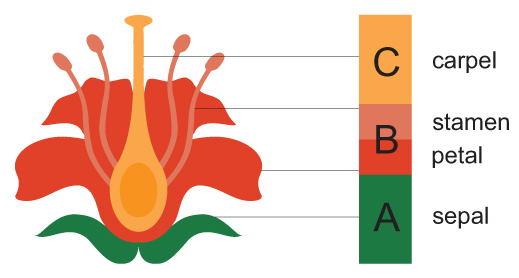
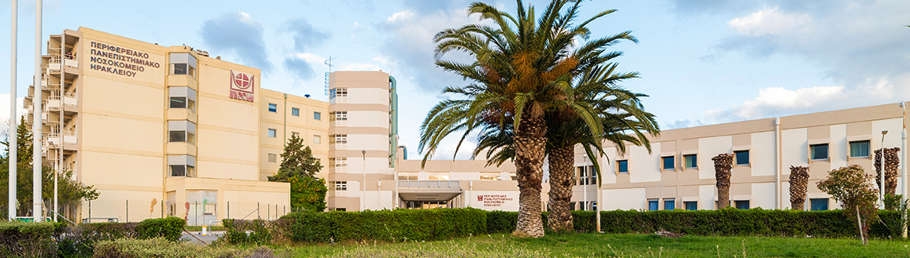
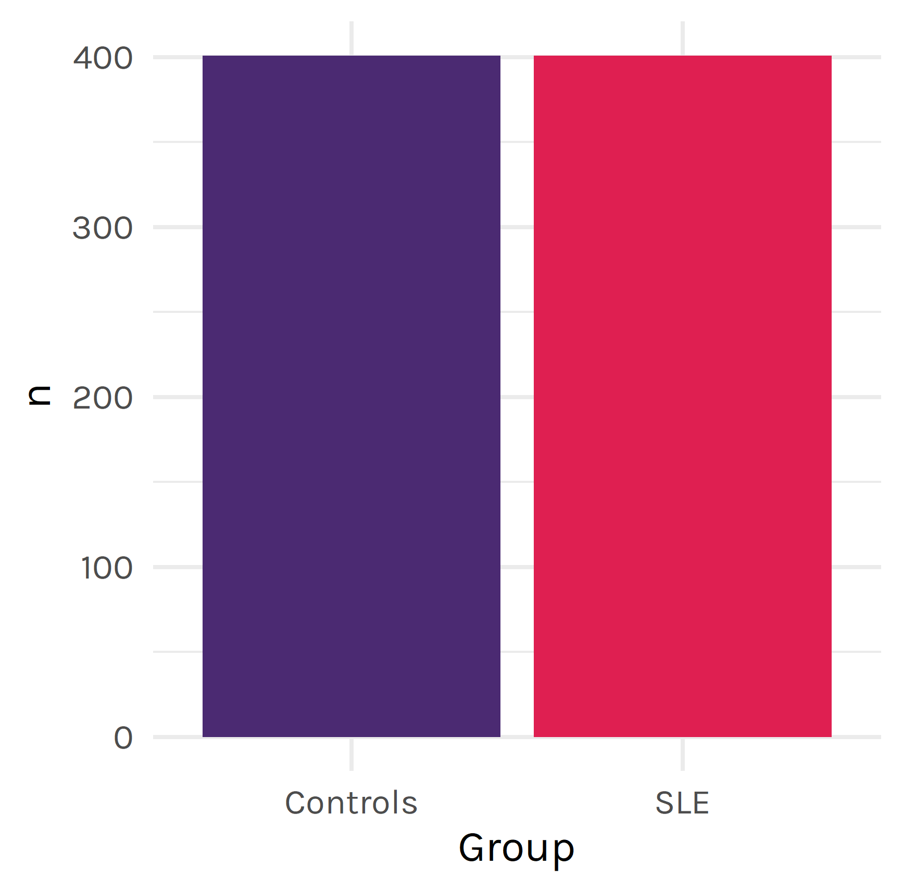
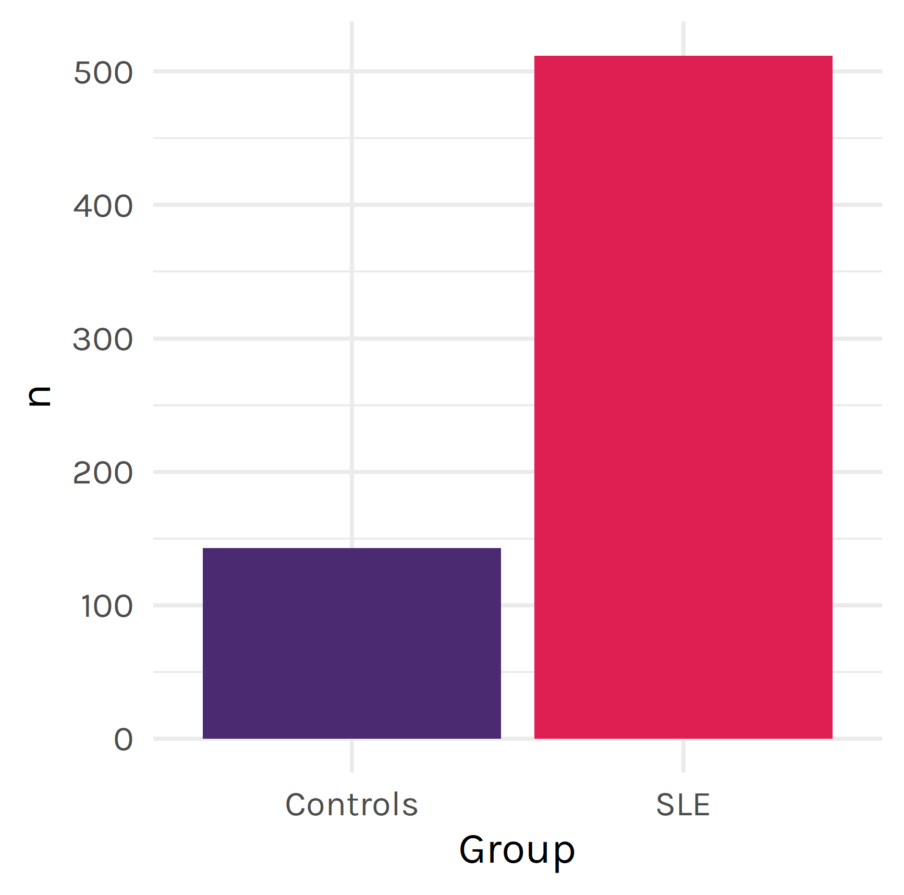
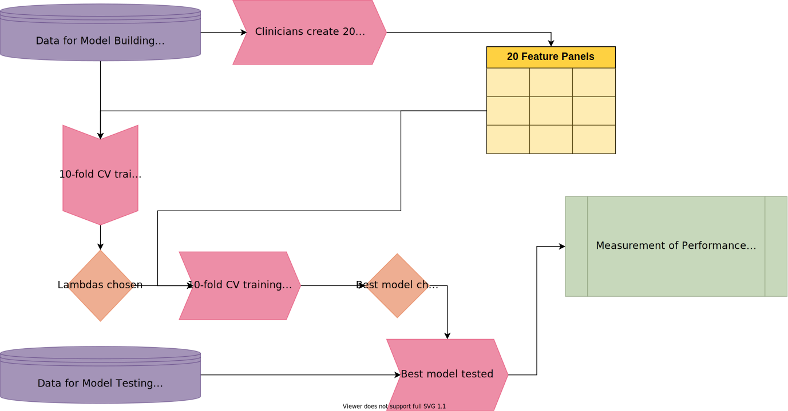
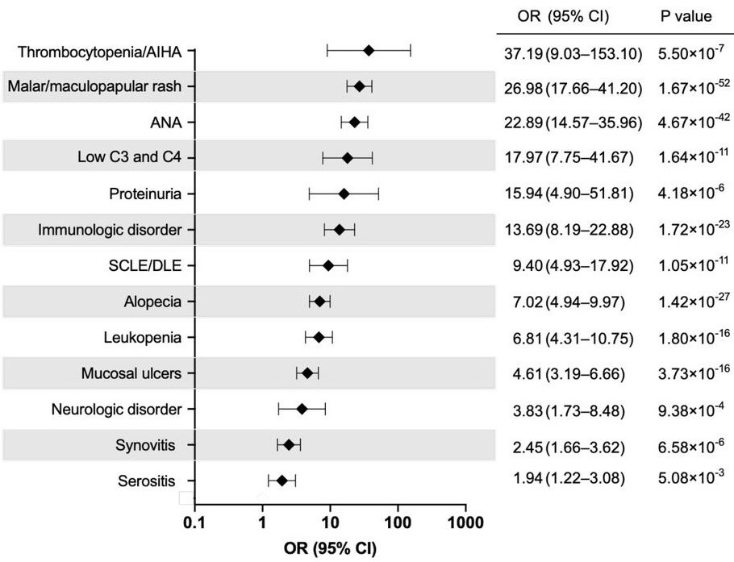
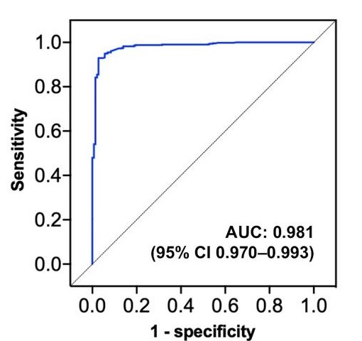
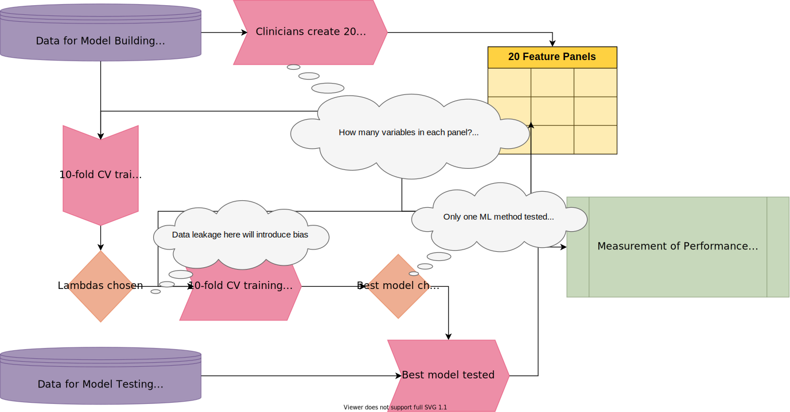
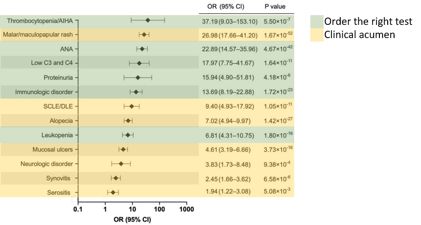
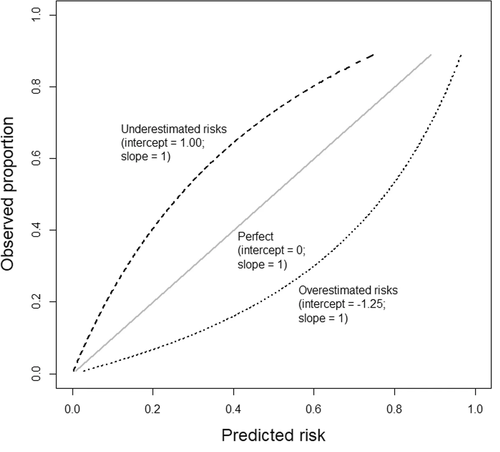

```{r setup, include=FALSE}
knitr::opts_chunk$set(echo = FALSE, fig.align="center")

library(tidyverse)
library(glmnet)
library(tidymodels)
library(gganimate)

data("iris")
iris <- as_tibble(iris) %>% 
  rename_with(~str_replace(., "\\.", " "))

source(file = "style.R")
```

# Mathematics

```{r echo=FALSE}
htmltools::includeHTML("floating_logo.html")
```

## Ordinary Least Squares (OLS) Regression

We estimate outcomes using regression, but how do we obtain coefficients 𝛽?

$$
\hat{y}=\beta_0 + \beta_1 x
$$

The most common approach uses OLS, a method where the coefficients are obtained by finding the values that results in the *least square error*:

$$
RSS=\sum_{1=1}^{n}(y_i -(\hat{\beta_0}+\hat{\beta_1}x_i))^2
$$

## LASSO Regression

$$
RSS=\sum_{1=1}^{n}(y_i -(\hat{\beta_0}+\hat{\beta_1}x_i))^2 + \lambda|\beta_1|
$$

# Iris Dataset

```{r fig.align="center", out.height=278, out.width=519}

```

```{r echo=FALSE}
knitr::kable(head(iris)) %>% 
  kableExtra::kable_classic(bootstrap_options = "striped", full_width = F)
```

# Iris Dataset

```{r echo=FALSE, message=FALSE, warning=FALSE, fig.align="center"}
iris %>% 
  select(-Species) %>% 
  pivot_longer(cols = -`Petal Width`, names_to = "Feature", values_to = "Value") %>% 
  ggplot(aes(x = Value, y = `Petal Width`, col = Feature)) + 
  geom_point() +
  geom_smooth(method = "lm", se = FALSE, col = "black") +
  facet_wrap(~Feature, nrow = 3, scales = "free", strip.position = "top") +
  theme(legend.position = "none", strip.background = element_rect(fill = "#EAEAEA"))
```

# LASSO

```{r echo=FALSE, message=FALSE, warning=FALSE, fig.align="center"}
all_lambdas <- tibble(lambdas = 10^seq(-5, 3, by = 0.1))
models <- all_lambdas %>% 
  mutate(lasso = map(lambdas,
                     ~glmnet(
                       as.matrix(
                         select(iris, 
                                `Petal Length`, 
                                `Sepal Length`,
                                `Sepal Width`
                         )
                       ), 
                       iris$`Petal Width`,
                       lambda = .x)
  )
  ) %>% 
  mutate(tidied = map(lasso, tidy)) %>% 
  unnest(tidied)

lambda_plot <- models %>% 
  select(lambdas, term, estimate) %>% 
  filter(term != "(Intercept)") %>% 
  pivot_wider(names_from = term, values_from = estimate) %>% 
  right_join(all_lambdas, by = "lambdas") %>% 
  pivot_longer(cols = -lambdas) %>% 
  replace_na(list(value = 0)) %>%
  rename(Coefficient = value,
         Variable = name,
         Lambda = lambdas) %>% 
  ggplot(aes(x = Lambda, y = Coefficient, col = Variable)) +
  scale_x_log10() +
  xlab(expression(lambda)) +
  ggtitle("Predicting Petal Width") +
  geom_line(size = 2)

lambda_plot
```

# LASSO

```{r echo=FALSE, message=FALSE, warning=FALSE, fig.align="center"}
lambda_plot +
  geom_vline(xintercept = 0.1, size = 2, alpha = 0.5)
```

# Setting

Pooled data from two hospitals in **Greece** with established SLE registries.



# Data

## Collection

+----------------------------------------------------------------------------------------------+-----------------------------------------------------------------------------------------------------+
| Algorithm Development                                                                        | Algorithm Validation                                                                                |
+:============================================================================================:+:===================================================================================================:+
| Patients diagnosed between 01/2005 -- 06/2019 with SLE or other rheumatic disease (control). | Prospective collection of data for patients diagnosed with SLE or other rheumatic disease (control) |
+----------------------------------------------------------------------------------------------+-----------------------------------------------------------------------------------------------------+
| {width="500"}                                                     | {width="500"}                                                             |
+----------------------------------------------------------------------------------------------+-----------------------------------------------------------------------------------------------------+

# Data

## Variables

-   Demographics

-   All elements of three classification criteria (ACR 1997, SLICC 2012, EULAR/ACR 2019)

-   Extra data points at their discretion

# Data

```{r}
tibble::tribble(
              ~Col1,                    ~Col2,                       ~Col3,               ~Col4,                  ~Col5,            ~Col6,
      "ACR97 malar",         "SLICC Alopecia",   "SLICC clinical criteria",       "Neuro score",      "Hypocompl score",    "enteropathy",
    "ACR97 discoid",           "SLICC Ulcers",      "SLICC immun criteria", "EULAR serositis A",   "EULAR spec autoAbs",    "pneumonitis",
  "ACR97 photosens",        "SLICC Serositis",     "SLICC criteria fulfil", "EULAR serositis B",        "Autoabs score",            "ILD",
     "ACR97 ulcers",            "SLICC Renal", "SLICC classified criteria",   "Serositis score",      "EULAR ACR score", "alv hemorrhage",
  "ACR97 synovitis",              "SLICC CNS",               "EULAR fever",       "EULAR hem A", "EULAR ACR classified",            "TTP",
  "ACR97 serositis",             "SLICC AIHA",               "Fever score",       "EULAR hem B",              "fatigue",   "Splenomegaly",
      "ACR97 renal",       "SLICC Leucopenia",               "EULAR cut A",         "Hem score",            "lymphaden",  "epi scleritis",
     "ACR97 neurol", "SLICC Thrombocytopenia",               "EULAR cut B",     "EULAR renal A",                "sicca",        "uveitis",
    "ACR97 hematol",             "SLICC aDNA",               "EULAR cut C",     "EULAR renal B",        "dermographism",    "myocarditis",
    "ACR97 immunol",              "SLICC aSm",           "Cutaneous score",     "EULAR renal C",          "skin vascul",           "aRNP",
        "ACR97 ANA",              "SLICC aPL",           "EULAR synovitis",       "Renal score",               "livedo",           "aSSA",
      "ACR97 items",            "SLICC Compl",           "Synovitis score",         "EULAR aPL",            "urticaria",           "aSSB",
            "ACR97",           "SLICC Coombs",             "EULAR neuro A",         "aPL score",              "ascites",        "Raynaud",
       "SLICC ACLE",              "SLICC ANA",             "EULAR neuro B", "EULAR hypocompl A",            "hepatitis",       "Myositis",
       "SLICC CCLE",        "SLICC Kidney bx",             "EULAR neuro C", "EULAR hypocompl B",         "mes vasculit",            "SLE"
  ) %>% 
  knitr::kable(col.names = NULL) %>% 
  kableExtra::kable_styling(bootstrap_options = "striped", font_size = 18, full_width = F)


```

# Methods



# Results

## Control Groups

```{r}
tibble::tribble(
  ~Disease, ~Discovery, ~Validation,
  "Rheumatoid arthritis", "126 (31%)", "28 (20%)",
  "Undifferentiated connective tissue disease", "57 (14%)", "56 (39%)",
  "Sjogren’s syndrome", "43 (11%)", "11 (8%)",
  "Scleroderma", "42 (10%)", "11 (8%)",
  "Psoriatic arthritis", "25 (6%)", "7 (6%)",
  "Vasculitis", "22 (5%)", "2 (1%)",
  "Behcet’s disease", "17 (4%)", "2 (1%)",
  "Myositis", "19 (5%)", "9 (6%)",
  "Familial Mediterranean Fever", "18 (4%)", "3 (2%)",
  "Adult-onset still’s disease", "14 (3%)", "5 (3%)",
  "Fibromyalgia", "3 (1%)", "2 (1%)",
  "Primary antiphospholipid syndrome", "9 (2%)", "1 (1%)",
  "Chronic cutaneous lupus erythematosus", "6 (1%)", "4 (3%)"
) %>% 
  knitr::kable() %>% 
  kableExtra::kable_styling(bootstrap_options = "striped", full_width = F)
```

# Results

## Model comparison

```{r}
model_results <- tibble::tribble(
  ~Model,    ~Method,                                                                                                                                                                                                                                        ~`Brief.description/model.features`,  ~AUC,  ~ACC, ~SENS, ~SPEC,
    "M1",       "LR",                                                                                                                                                                                                                                      "ACR-1997 criteria (binary variable)", 89.28, 89.28, 85.55, 93.01,
    "M4", "Lasso-LR",                                                                                                                                                                                                    "ACR-1997 criteria (binary variable), low C3 or C4, maculopapular rash",  94.9, 91.76, 93.27, 90.26,
    "M5",       "RF",                                                                                                                                                                          "ACR-1997 criteria plus all non-redundant features from other criteria and non-criteria features", 95.07, 91.64, 93.02, 90.26,
    "M6",       "LR",                                                                                                                                                                                                                                     "ACR-1997 criteria (continuous score)",  95.7, 89.28, 85.55, 93.01,
    "M8", "Lasso-LR",                                                                                                                                                              "ACR-1997 criteria (continuous score), alopecia, low C3 or C4, interstitial lung disease, maculopapular rash", 97.44, 92.39, 93.27, 91.51,
   "M10",       "LR",                                                                                                                                                                                                                                             "SLICC-2012 (binary variable)", 92.52, 92.51, 91.28, 93.76,
   "M12",       "RF",                                                                                                                                                               "SLICC-2012 (binary variable) plus all non-redundant features from other criteria and non-criteria features", 95.84, 93.26, 92.52, 94.01,
   "M13",       "LR",                                                                                                                                                                                                                "SLICC-2012 (continuous clinical and immunological scores)", 97.34, 92.51, 94.26, 90.76,
   "M15", "Lasso-LR",                                                                                                                                                                                          "SLICC-2012 (continuous clinical and immunological scores), lymphopenia <1000/?L", 97.61, 92.89, 93.51, 92.26,
   "M17",       "LR",                                                                                                                                                                                                                                            "EULAR/ACR-2019 (binary model)", 92.27, 92.27, 87.29, 97.26,
   "M20", "Lasso-LR",                                                                                                                                                                                    "EULAR/ACR-2019 (binary model), photosensitivity, myositis, chronic CLE other than DLE", 96.09, 92.77, 88.04, 97.51,
   "M22",       "LR",                                                                                                                                                                                                                                   "EULAR/ACR-2019 (continuous score), ANA", 96.95, 91.89, 90.53, 93.26,
   "M25", "Lasso-LR",                                                                                                                                                                                    "EULAR/ACR-2019 (continuous score), ANA, livedo reticularis, interstitial lung disease",  97.4, 93.26, 92.53, 94.01,
   "M26",       "RF",                                                                                                                                                      "EULAR/ACR-2019 (continuous score), ANA plus all nonredundant features from other criteria and non-criteria features",  97.9, 92.89, 91.28, 94.51,
   "M31", "Lasso-LR", "De novo model including: mucosal ulcers, synovitis, serositis, immunologic disorder (modified), ANA, alopecia, neurological disorder, malar/maculopapular rash, SCLE or DLE, leucopenia, thrombocytopenia or AIHA, proteinuria, low C3 and C4, interstitial lung disease", 98.32, 95.02, 94.53, 95.51
  )

knitr::kable(model_results) %>% 
  kableExtra::kable_styling(bootstrap_options = "striped", font_size = 16, full_width = T) %>% 
  kableExtra::row_spec(which(model_results$AUC >97), bold = T, color = "white", background = "#df1f51") %>% 
  kableExtra::row_spec(which(model_results$AUC >98), bold = T, color = "white", background = "#4b2a72")

```

# Final Model - Variables

+----------------------------------------------------------------------------------------+----------------------+
| Positive Correlation                                                                   | Negative Correlation |
+========================================================================================+======================+
| Autoimmune thrombocytopenia or haemolytic anaemia (EULAR/ACR 2019)                     | ILD                  |
+----------------------------------------------------------------------------------------+----------------------+
| Malar or maculopapular rash (EULAR/ACR 2019)                                           |                      |
+----------------------------------------------------------------------------------------+----------------------+
| Low C3 and C4 (EULAR/ACR 2019)                                                         |                      |
+----------------------------------------------------------------------------------------+----------------------+
| Proteinuria (EULAR/ACR 2019)                                                           |                      |
+----------------------------------------------------------------------------------------+----------------------+
| SCLE/DLE (EULAR/ACR 2019)                                                              |                      |
+----------------------------------------------------------------------------------------+----------------------+
| Leukopenia (EULAR/ACR 2019)                                                            |                      |
+----------------------------------------------------------------------------------------+----------------------+
| ANA (ACR 1997)                                                                         |                      |
+----------------------------------------------------------------------------------------+----------------------+
| Immunological disorder (ACR 1997, modified to include anti-β2-glycoprotein antibodies) |                      |
+----------------------------------------------------------------------------------------+----------------------+
| Mucosal ulcers (ACR 1997)                                                              |                      |
+----------------------------------------------------------------------------------------+----------------------+
| Synovitis (ACR 1997)                                                                   |                      |
+----------------------------------------------------------------------------------------+----------------------+
| Serositis(ACR 1997)                                                                    |                      |
+----------------------------------------------------------------------------------------+----------------------+

# Final Model - Validation

|                          |                           |
|--------------------------|---------------------------|
|  |  |

# Final Model - Cutpoint Performance

```{r}
contingency <- tibble(Prediction = c("SLE", "Not SLE", "SLE", "Not SLE"),
                      Actual = c("SLE", "Not SLE", "Not SLE", "SLE"),
                      n = c(487, 134, 9, 25)) %>% 
  pivot_wider(names_from = Actual, values_from = n)

subgroups <- tibble(Subgroup = c("Early SLE (n=276)", "LN (n=48)", "NPL (n=61)",
                                 "Haem (n=74)", "Severe (n=110)"),
                    Sensitivity = c(0.928, 0.979, 0.918, 0.986, 0.964))

knitr::kables(
  list(
    knitr::kable(subgroups) %>% 
      kableExtra::kable_classic(),
    knitr::kable(contingency) %>% 
      kableExtra::kable_classic() %>% 
      kableExtra::add_header_above(c(" " = 1, "Actual" = 2))
  )
) %>% 
  kableExtra::kable_styling(position = "center")
  
```

# Criticisms of the Method


# Criticisms of the Method



# Criticisms of the Cohort

## Who were these patients?

-   Patients with **established SLE**, in a registry.
-   These were **not patients** captured at the point when a clinician was attempting to **answer the question: is this SLE?**

## Early SLE

-   More than half the validation cohort.
-   Early? Maybe.
-   Established? Definitely - by definition they had to have a well-established diagnosis to enter into a lupus registry

# Criticisms of the Data

## Input data is generated by experts



# Criticisms of the Reporting

-   Long section on risk thresholds and SLE sorting patients into likelihood groups (e.g. certain SLE, likely, possible, unlikely etc.)
-   BUT there was no model calibration

{width="539"}

# My Own Research

|                                      |                                        |
|--------------------------------------|----------------------------------------|
| {width="119"} | {width="200"} |

-   Working in Rheumatology and Clinical Pharmacology (Medicines Optimisation Service)

-   Starting PhD

    -   Faculty of Engineering and Information Technology

        -   Centre for Digital Transformation of Health (MDHS)
        -   Melbourne Centre for Data Science

    -   Supervisors

        -   Dr Douglas Pires
        -   Prof Wendy Chapman
        -   A/Prof Russell Buchanan

# My Own Research

|                                      |                                        |
|--------------------------------------|----------------------------------------|
| {width="119"} | {width="200"} |

-   Working in Rheumatology and Clinical Pharmacology (Medicines Optimisation Service)

-   Starting PhD

    -   Research area

        -   Multi-model machine learning for prediction & detection

            -   Structured EMR data
            -   **Text**
            -   **Images**

        -   Adverse Drug Reactions

            -   Detection & prediction

            -   Focus on immune-related adverse events (irAEs)

                -   Detect, predict, study

McMaster, Christopher, David Liew, Claire Keith, Parnaz Aminian, and Albert Frauman. 2019. "A Machine-Learning Algorithm to Optimise Automated Adverse Drug Reaction Detection from Clinical Coding." Drug Saf. 42 (6): 721--25. <https://doi.org/10.1007/s40264-018-00794-y.>
